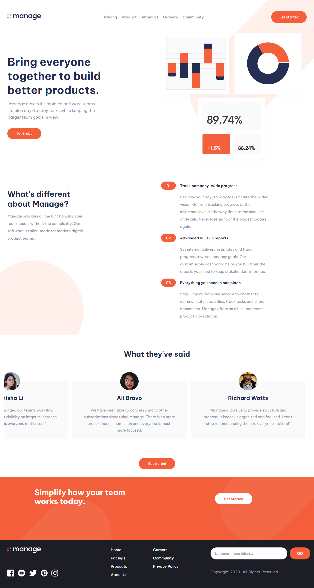

# Manage landing page

This is a solution to the [Manage landing page challenge on Frontend Mentor](https://www.frontendmentor.io/challenges/manage-landing-page-SLXqC6P5). 

## Table of contents

- [Manage landing page](#manage-landing-page)
  - [Table of contents](#table-of-contents)
  - [Overview](#overview)
    - [The challenge](#the-challenge)
    - [Screenshot](#screenshot)
    - [Links](#links)
    - [Built with](#built-with)
    - [What I learned](#what-i-learned)
  - [Installation](#installation)
  - [Author](#author)


## Overview

### The challenge

Users should be able to:

- View the optimal layout for the site depending on their device's screen size
- See hover states for all interactive elements on the page
- See all testimonials in a horizontal slider


### Screenshot



### Links

- Live Site URL: [Click here](https://daalu-manage-page.netlify.app/)


### Built with

- React.js
- Semantic HTML5 markup
- CSS custom properties
- Flexbox
- CSS Grid
- Mobile-first workflow


### What I learned

- I figured out how to target hover device with media query. It is used convienenty to target device with ability to hover an element.
- Learnt about draggable slider. 


```css
media (hover: hover) {
    body{
        background-color: red;
    }
}
```

## Installation 

- Clone repo into your drive
- cd into the repo
- run npm install on the terminal
- after installation of packages, run npm start
## Author

- Twitter - [@Dhevine_0X](https://www.twitter.com/Dhevine_0X)
